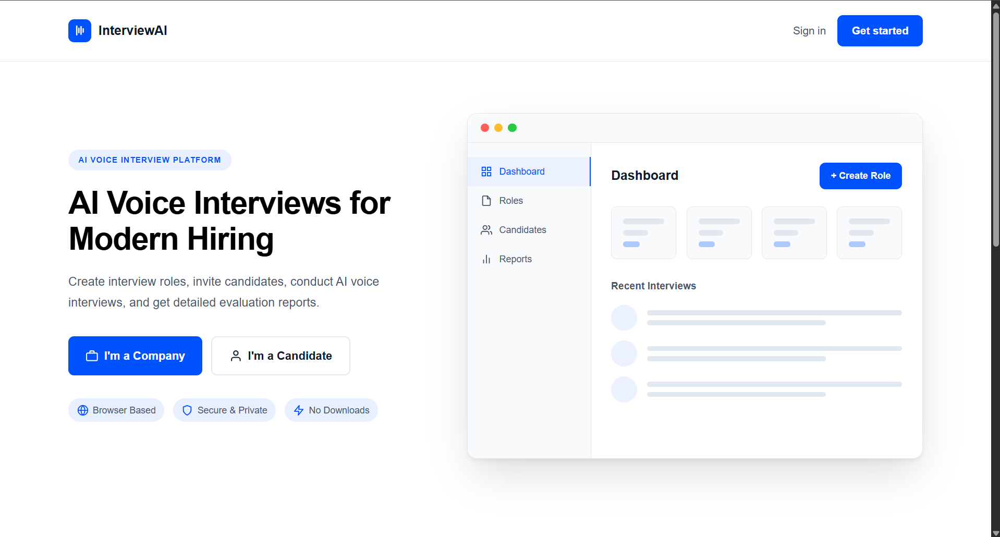
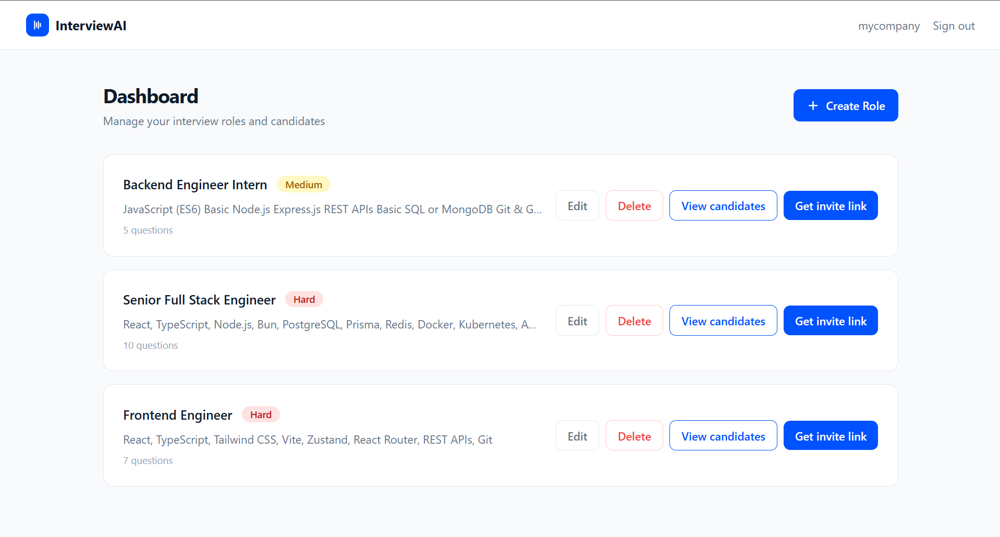
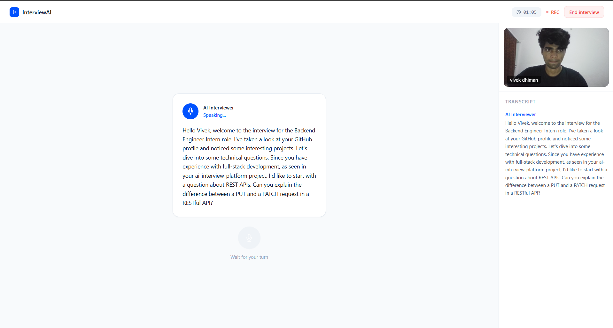
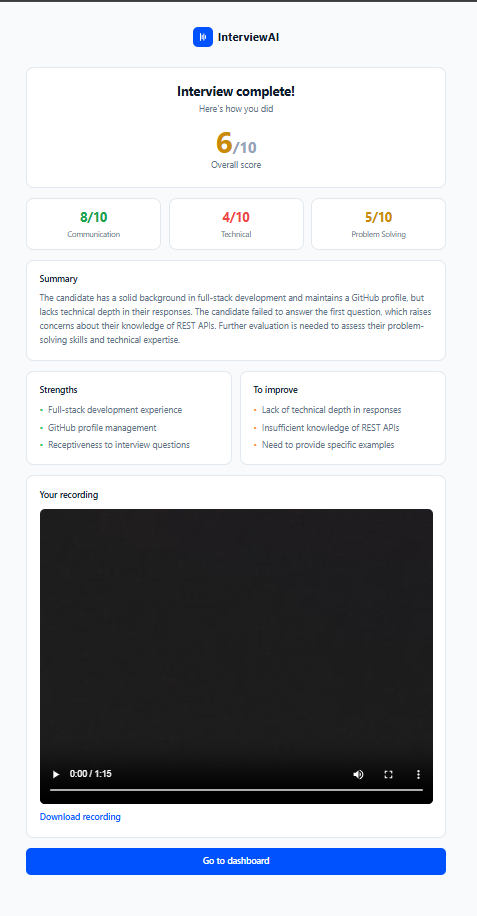

# InterviewAI — AI Voice Interview Platform

InterviewAI is a B2B SaaS platform that enables companies to conduct AI-powered voice interviews at scale. Instead of asking predefined questions, the AI interviewer dynamically adapts the interview based on the candidate's responses and GitHub profile, providing a realistic technical interview experience.

The platform automates interview scheduling, conducts real-time voice conversations, records interviews, evaluates candidates, and generates detailed performance reports.

---

# Screenshots

## Landing Page



## Company Dashboard



## Live Voice Interview



## Interview Report



---

# Features

## Company Features

- Company authentication with JWT
- Create technical roles
- Configure:
  - Tech stack
  - Difficulty level
  - Experience level
  - Interview duration
  - Number of questions
- Generate unique candidate invite links
- Track interview progress
- View candidate reports
- Access interview transcripts
- View interview recordings

---

## Candidate Features

- Secure invite-based interview access
- Candidate authentication
- Personalized interview based on GitHub profile
- Real-time AI voice interviewer
- Video recording during interview
- Live conversation using WebSockets
- Full interview history
- Detailed report cards
- Prevent duplicate interviews on the same invite

---

## AI Features

- GitHub profile analysis
- Personalized interview generation
- Dynamic follow-up questions
- Adaptive questioning based on previous answers
- Technical skill evaluation
- Communication assessment
- Problem-solving evaluation
- Confidence analysis
- Overall candidate scoring
- AI-generated feedback for every question

---

# System Architecture

```text
                          ┌─────────────────────────────┐
                          │      React Frontend         │
                          ├─────────────────────────────┤
                          │ Landing Page               │
                          │ Company Dashboard          │
                          │ Candidate Dashboard        │
                          │ Live Interview             │
                          │ Report Viewer             │
                          └──────────────┬─────────────┘
                                         │
                              REST API + WebSocket
                                         │
                     ┌───────────────────▼───────────────────┐
                     │         Bun + TypeScript API          │
                     ├───────────────────────────────────────┤
                     │ Authentication                        │
                     │ Company APIs                          │
                     │ Candidate APIs                        │
                     │ Role Management                       │
                     │ Interview Engine                      │
                     │ Report Generation                     │
                     │ WebSocket Server                      │
                     └───────┬──────────────┬────────────────┘
                             │              │
                    SQLite Database     Groq LLM API
                             │              │
               Companies      │      AI Interviewer
               Candidates     │      Question Generation
               Roles          │      Candidate Evaluation
               Interviews     │      Report Generation
               Reports        │
```

---

# Interview Flow

```text
Candidate Opens Invite Link
            │
            ▼
Authentication
            │
            ▼
Fetch Candidate & Role Details
            │
            ▼
Analyze GitHub Profile
            │
            ▼
Create Interview Session
            │
            ▼
Establish WebSocket Connection
            │
            ▼
AI Generates Opening Question
            │
            ▼
Browser Speech Recognition
            │
            ▼
Transcript Sent to Backend
            │
            ▼
LLM Evaluates Response
            │
            ▼
Generate Follow-up Question
            │
            ▼
Repeat Until Interview Ends
            │
            ▼
Generate Final Report
            │
            ▼
Save Report to Database
            │
            ▼
Display Results
```

---

# Tech Stack

## Backend

- Bun
- TypeScript
- SQLite (bun:sqlite)
- Native Bun WebSockets
- Groq API (LLaMA 3.3 70B)
- JWT Authentication
- bcryptjs

---

## Frontend

- React
- Vite
- TypeScript
- Tailwind CSS
- Zustand
- Axios
- React Router v6
- Web Speech API
- MediaRecorder API

---

# Project Structure

```text
InterviewAI
│
├── Backend
│   ├── src
│   │   ├── config
│   │   ├── controllers
│   │   ├── database
│   │   ├── middleware
│   │   ├── routes
│   │   ├── services
│   │   ├── websocket
│   │   ├── utils
│   │   ├── types
│   │   └── server.ts
│   │
│   ├── package.json
│   └── tsconfig.json
│
├── Frontend
│   ├── src
│   │   ├── components
│   │   ├── hooks
│   │   ├── layouts
│   │   ├── pages
│   │   ├── router
│   │   ├── services
│   │   ├── store
│   │   ├── types
│   │   └── App.tsx
│   │
│   ├── package.json
│   └── vite.config.ts
│
└── README.md
```

---

# Database Overview

The application stores information for:

- Companies
- Candidates
- Roles
- Interview Sessions
- Questions
- Responses
- Reports
- Interview Recordings

---

# Authentication

- JWT Access Tokens
- Secure Password Hashing using bcryptjs
- Protected Company Dashboard
- Protected Candidate Dashboard

---

# AI Interview Pipeline

```text
GitHub Profile
       │
       ▼
Profile Analysis
       │
       ▼
Interview Context
       │
       ▼
Question Generation
       │
       ▼
Candidate Answer
       │
       ▼
LLM Evaluation
       │
       ▼
Follow-up Question
       │
       ▼
Final Assessment
       │
       ▼
Structured Report
```

---

# Report Card Includes

- Overall Score
- Technical Knowledge
- Communication Skills
- Problem Solving
- Confidence
- Strengths
- Weaknesses
- Question-wise Evaluation
- AI Feedback
- Complete Transcript

---

# Local Setup

## Clone Repository

```bash
git clone <repository-url>
cd InterviewAI
```

---

## Backend

```bash
cd Backend

bun install

cp .env.example .env
```

Configure `.env`

```env
GROQ_API_KEY=your_api_key
JWT_SECRET=your_secret
PORT=3000
```

Start the backend

```bash
bun run dev
```

---

## Frontend

```bash
cd Frontend

bun install
```

Create `.env.local`

```env
VITE_API_URL=http://localhost:3000
```

Run the frontend

```bash
bun run dev
```

---

# Future Improvements

- Resume parsing
- Multi-language interviews
- Emotion analysis
- Lip-sync avatar interviewer
- Live coding interviews
- Screen sharing
- Company analytics dashboard
- Email notifications
- Calendar integration
- Interview scheduling
- Team collaboration
- Multiple LLM provider support

---

# Why InterviewAI?

Traditional technical interviews consume significant engineering time and often lack consistency. InterviewAI automates the entire first-round interview process using conversational AI while maintaining personalization through GitHub profile analysis and adaptive questioning.

Companies can evaluate more candidates in less time, while candidates receive a natural interview experience with detailed feedback.

---

# License

MIT License
